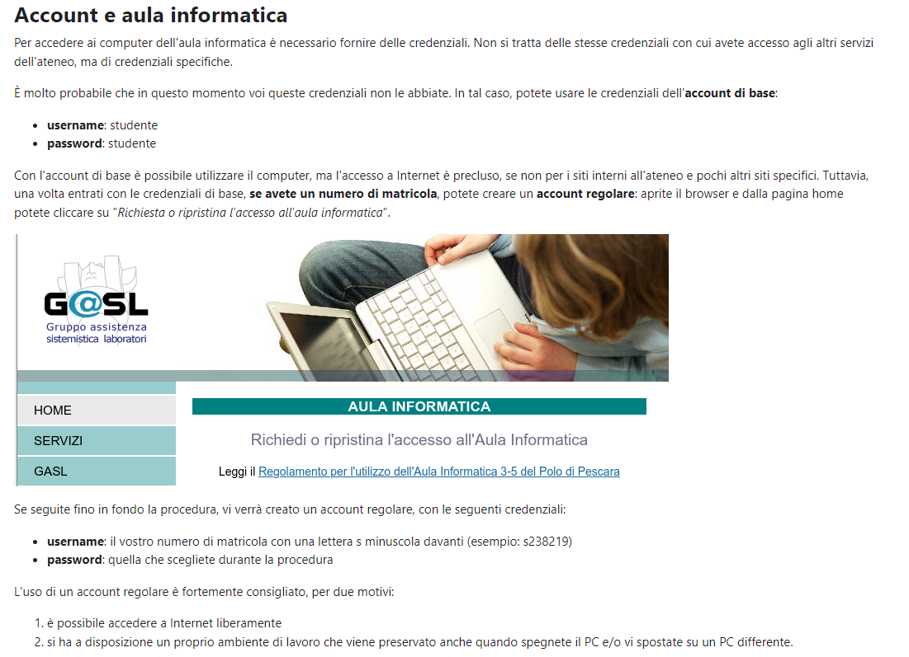

<h1> Premessa: Ricordati di scaricare VsCode e Python 3.10, ti lascio la [guida](https://fad.unich.it/mod/page/view.php?id=24971). </h1>

<h3>- Esercizi 1 e 2</h3>
Nulla di pratico, ti spiega come creare l'account per accedere a uno qualsiasi dei computer 
presenti nell'aula informatica. Ti lascio il link del [documento](https://fad.unich.it/mod/page/view.php?id=25736)

Ti lascio un'immagine esplicativa su ciò che interessa esercizio 1-2:

<h3> Esercizi 3,4 e 5</h3>
Sono tutti svolti sul terminale e sono abbastanza superflui, trattano l'esecuzione del comando print("Puoi scrivere quello che vuoi") da terminale oppure 
attraverso un file di testo .py(estensione di un file python). Detto questo, ti riassumo per elencazione i vari comandi che puoi utilizzare sia in Windows che Linux per fare ciò:

- Windows:
1. Apertura del terminale -> Puoi farlo con la combinazione tasti "Win + R" e poi, all'interno della finestra che si apre digiti "cmd" e fai esegui;
2. Elenco delle cartelle -> Il comando "dir" ti elenca tutte le cartelle presenti sul desktop;
3. Entrata ambiente python -> Basta digitare "python3" nel terminale. Per uscire dall'ambiente, si utilizza il comando "quit()";
4. Ricezione in output di un valore testuale -> Dopo essere entrato, puoi digitare l'istruzione "print("Puoi scrivere quelle che vuoi")" e il terminale ti stampa la scritta nella riga successiva;
5. Creazione file python -> Esci dall'ambiente python. Per creare un file python bisogna seguire questa dicitura: "nome.py", il comando per creare il file da terminale è "type nul > nome.py".
Il file viene creato vuoto, devi aprirlo come se fosse un documento di testo e scrivere l'istruzione "print()" al suo interno;
6. Esecuzione del file -> Devi entrare nella cartella dove hai salvato il file e scrivere "python nome.py". Esempio: "C:\Users\nepae\Desktop>python test.py"

- Linux
1. Apertura del terminale -> Puoi farlo con la combinazione tasti "Ctrl + Alt + T";
2. Elenco delle cartelle -> Il comando "ls" ti elenca tutte le cartelle presenti sul desktop.
3. Entrata ambiente python -> Basta digitare "python3" nel terminale. Per uscire dall'ambiente, si utilizza il comando "quit()";
4. Ricezione in output di un valore testuale -> Dopo essere entrato, puoi digitare l'istruzione "print("Puoi scrivere quelle che vuoi")" e il terminale ti stampa la scritta nella riga successiva;
5. Creazione file python -> Esci dall'ambiente python. Per creare un file python bisogna seguire questa dicitura: "nome.py", il comando per creare il file da terminale è "touch nome.py".
Il file viene creato vuoto, devi aprirlo come se fosse un documento di testo e scrivere l'istruzione "print()" al suo interno;
6. Esecuzione del file -> Devi entrare nell'ambiente python e scrivere "cat nome.py".

<h3> Esercizi 6,7,8 e 9</h3>
Il resto degli esercizi li trovi nella cartella "02_09_23" e sono dei file da aprire su VsCode. Troverai dei commenti(#verde) dove ti spiego le varie istruzioni. Se hai dubbi, scrivimi!
